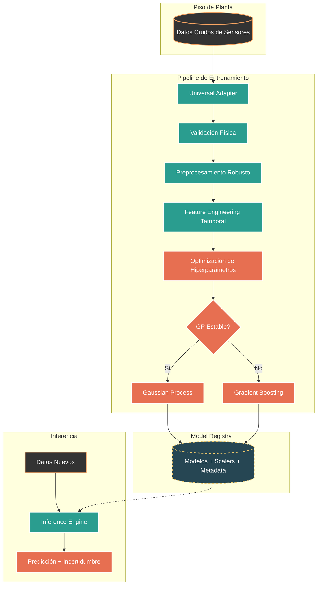

# ⚒️ Proyecto Minero 4.0

## Inteligencia Artificial para Procesos de Flotación

<div align="center">


**Pipeline ETL industrial y Soft-Sensor predictivo para control de calidad en tiempo real**

</div>

---

## 📋 Resumen Ejecutivo

Este proyecto implementa una solución de **Minería 4.0** orientada a la optimización de plantas de procesamiento de minerales. El sistema reemplaza análisis de laboratorio lentos y costosos mediante un **Soft-Sensor basado en Inteligencia Artificial**, capaz de predecir variables críticas de calidad (por ejemplo, **% de Sílice** o **Recuperación Metalúrgica**) en tiempo casi real a partir de datos de sensores de planta.

La arquitectura está diseñada con un enfoque **industrial y productivo**, combinando:

* **Procesos Gaussianos (GP)** para modelar precisión e incertidumbre.
* **Gradient Boosting** como respaldo robusto frente a ruido, no estacionariedad y condiciones operativas cambiantes.

El sistema está preparado para integrarse con historiadores industriales (por ejemplo, SCADA o PI System) y extenderse hacia estrategias de **Advanced Process Control (APC)**.

---

## 🎯 Objetivo del Sistema

Predecir variables críticas del proceso de flotación (**target**) a partir de variables operativas (**features**) con métricas de nivel industrial:

* **R² ≥ 0.95**
* **MAPE < 2%**

habilitando soporte a la toma de decisiones operativas, control avanzado de procesos y reducción de dependencia de laboratorio.

---

## 🏗️ Arquitectura del Sistema

El sistema se estructura en dos pipelines principales:

* **Entrenamiento (Batch / Offline)**
* **Inferencia (Simulación de Tiempo Real)**



El **modelo campeón** se selecciona automáticamente según métricas de validación y se registra junto con sus transformaciones, parámetros y metadata operativa.

---

## ✨ Características Clave de Ingeniería

* **Ingesta Universal de Datos**
  Lectura automática de archivos CSV industriales, detección de separadores y timestamps, con filtrado por expresiones regulares para evitar *data leakage*.

* **Modelado Híbrido Inteligente**

  * Prioriza **Gaussian Processes** con kernels físicamente restringidos.
  * Activa **fallback automático a Gradient Boosting** si el GP no alcanza desempeño mínimo (R² < 0.6).

* **Conciencia Temporal Estricta**
  Respeto explícito de la flecha del tiempo (sin `shuffle`), generación de *lags* y ventanas móviles para capturar la dinámica del proceso.

* **Motor de Inferencia Orientado a Producción**
  Carga automática del último modelo válido, validación de esquema de entrada y generación de predicción junto a su incertidumbre.

---

## 🏆 Resultados de Desempeño

Evaluado con datasets reales de procesos de flotación:

| Métrica  | Resultado (Gradient Boosting) | Interpretación Operacional                    |
| -------- | ----------------------------- | --------------------------------------------- |
| **R²**   | **0.9707**                    | Explica el 97% de la variabilidad del proceso |
| **MAPE** | **1.43%**                     | Error comparable a análisis de laboratorio    |
| **RMSE** | **1.74**                      | Baja dispersión del error                     |

Los gráficos de ajuste, residuos y validación se generan automáticamente en la carpeta `results/` tras cada entrenamiento.

---

## 🚀 Instalación

### 1. Clonar el repositorio

```bash
git clone https://github.com/CienciaEstelar/proyecto_minero_4.0.git
cd proyecto_minero_4.0
```

### 2. Crear entorno virtual

```bash
python -m venv .venv
source .venv/bin/activate
```

### 3. Instalar dependencias

```bash
pip install -r requirements.txt
```

---

## ⚙️ Configuración de Datos

1. Coloca tu archivo CSV de sensores en la carpeta `data/` (ignorados por git).
2. Edita `config/dataset_config.json` para definir:

   * Archivo de entrada
   * Columna objetivo (target)
3. (Opcional) Copia `.env.example` a `.env` para parámetros avanzados.

---

## 🎮 Uso del Sistema

### Entrenamiento

```bash
python train_universal.py
```

El sistema ejecuta el pipeline ETL completo, selecciona el modelo campeón y lo registra en `models/`.

### Inferencia

```bash
python predict_universal.py
```

Simula datos en tiempo real y presenta una comparación entre valor real y predicción del modelo.

---

## 📂 Estructura del Proyecto

```text
proyecto_minero_4.0/
├── config/                  # Configuración del sistema
├── core/                    # Núcleo lógico del sistema
│   ├── adapters/            # Ingesta de datos
│   ├── models/              # Modelos de IA
│   ├── validation/          # Reglas físicas y de negocio
│   └── inference_engine.py  # Motor de inferencia
├── data/                    # Datos de entrada (gitignore)
├── models/                  # Modelos entrenados
├── results/                 # Reportes y gráficos
├── logs/                    # Trazabilidad
├── train_universal.py       # Orquestador de entrenamiento
├── predict_universal.py     # Orquestador de inferencia
├── requirements.txt
└── README.md
```

---

<div align="center">

**Desarrollado para Minería 4.0**
Juan Galaz — Arquitectura Minera

</div>
